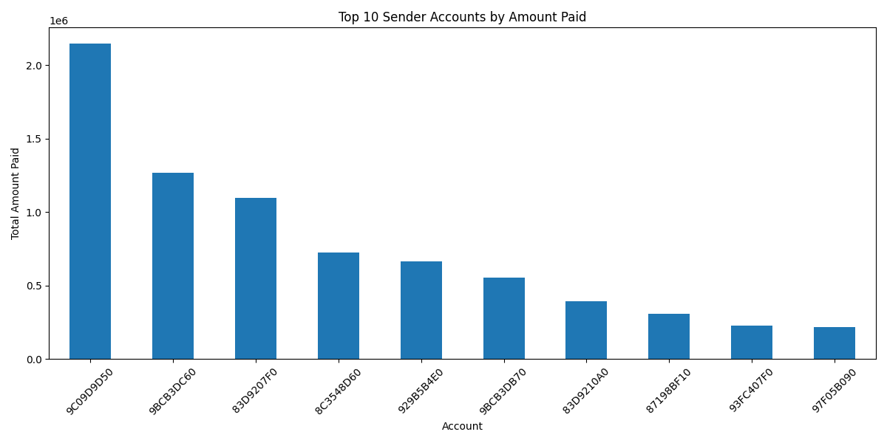
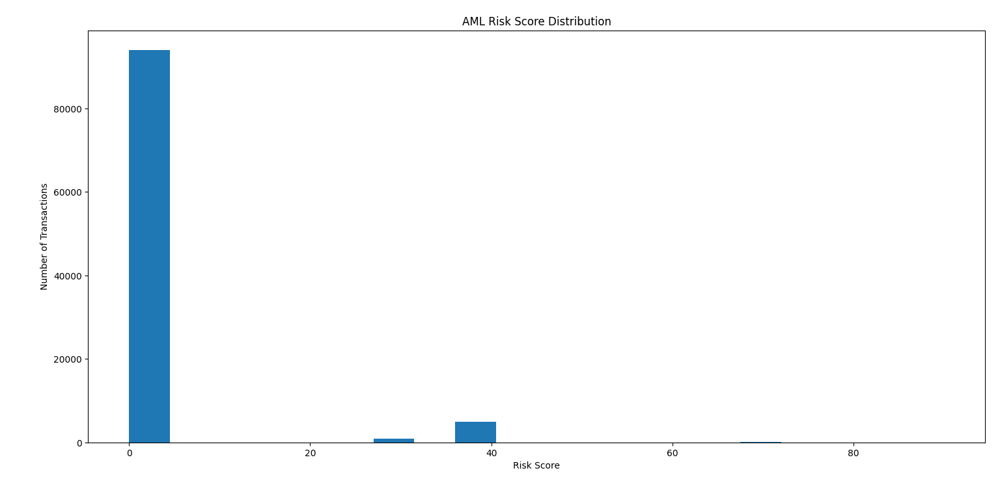
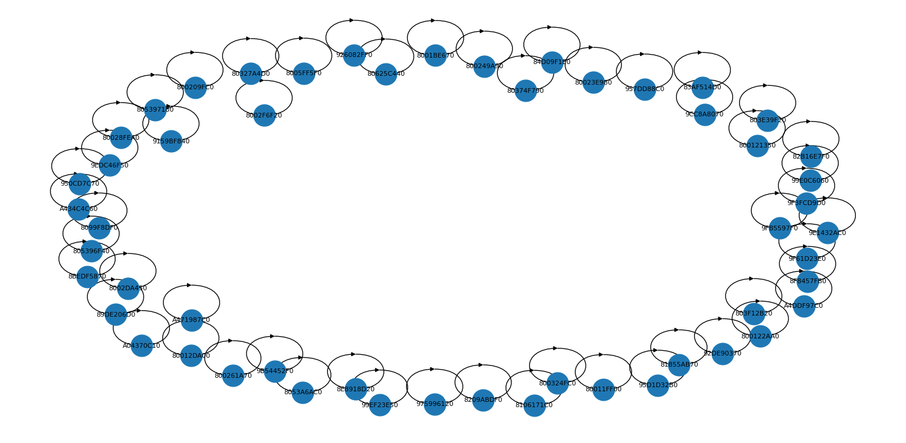
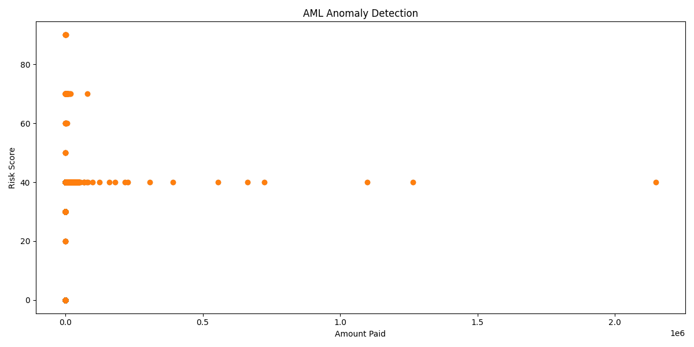
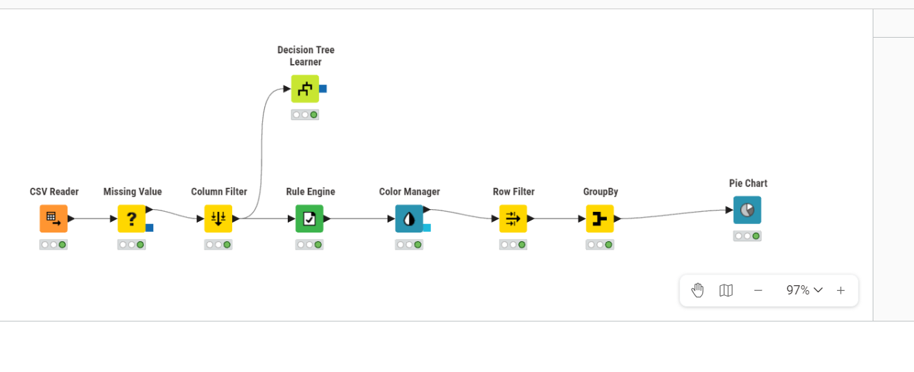

# AML Transaction Monitoring Analysis Report

**Project:** Anti-Money Laundering Transaction Monitoring

**Report date:** 2026-05-26

**Data basis:** First 100,000 rows from `raw-data/trans_3000p2_list.txt`

**Dataset type:** IBM synthetic AML transaction data

## Executive Summary

This project evaluates a sample of transactional data for possible money
laundering indicators using rule-based risk scoring, exploratory
visualizations, network analysis, and Isolation Forest anomaly detection.

The analyzed sample contains 100,000 transactions totaling **26,308,200.17**
across **98,970 sender accounts**. A rule-based approach flagged **58
transactions** with risk scores of 70 or above, while Isolation Forest
identified **1,942 anomalies**. However, the sample includes **7 transactions
labeled as laundering**, and none are identified by either the high-risk
cutoff or the anomaly model.

The project successfully creates an initial monitoring pipeline and dashboard
dataset, but its existing detection rules should not be considered effective
for laundering detection without further feature engineering and validation.

## Scope And Data

The source transaction file is approximately 4.53 GB. The Python analysis
scripts load only the first 100,000 rows for manageable exploratory analysis.
The sampled transactions occur from `2019-01-01 00:00:00` through
`2019-01-01 19:13:00`.

The dataset is attributed to IBM synthetic AML data prepared by Erik Altman.
Its documentation describes transactions and laundering labels
created from a virtual-world simulation rather than real customer data. The
source data and generated CSV outputs are not included in the GitHub
repository. The source may be downloaded from:
<https://www.kaggle.com/datasets/ealtman2019/ibm-transactions-for-anti-money-laundering-aml>.

| Sample Metric | Value |
| --- | ---: |
| Transactions | 100,000 |
| Columns after feature engineering | 19 |
| Total amount paid | 26,308,200.17 |
| Average amount paid | 263.08 |
| Median amount paid | 36.17 |
| Maximum amount paid | 2,148,968.16 |
| Unique senders | 98,970 |
| Unique receivers | 90,560 |
| Payment currencies | 14 |

Payment formats in the sample are concentrated in credit cards:

| Payment Format | Transactions |
| --- | ---: |
| Credit Card | 98,142 |
| ACH | 1,829 |
| Cheque | 29 |

## Methodology

### Feature Engineering

The pipeline creates timestamp features (`Hour`, `Day`, and `Month`) and four
risk indicators.

| Feature | Definition | Observed Count |
| --- | --- | ---: |
| `Cross_Border` | Receiving currency is different from payment currency | 1,015 |
| `Large_Transaction` | Amount paid exceeds the sample 95th percentile (`288.52`) | 5,000 |
| `Round_Amount` | Amount paid is divisible by 1,000 | 0 |
| `Sender_Frequency` | Number of payments made by the sender | Calculated per sender |

### Risk Score

The risk score is calculated as:

```text
Risk Score =
  (Cross_Border * 30)
  + (Large_Transaction * 40)
  + (Round_Amount * 10)
  + ((Sender_Frequency > 20) * 20)
```

Risk score distribution:

| Risk Score | Transactions |
| ---: | ---: |
| 0 | 94,037 |
| 20 | 6 |
| 30 | 953 |
| 40 | 4,932 |
| 50 | 4 |
| 60 | 10 |
| 70 | 52 |
| 90 | 6 |

### Anomaly Detection

An `IsolationForest` model is applied with `contamination=0.02` and
`random_state=42`, using:

- `Amount Paid`
- `Sender_Frequency`
- `Risk_Score`

The model classifies **1,942 transactions (1.942%)** as anomalies.

## Results

### Monitoring Indicators

| Indicator | Count | Rate |
| --- | ---: | ---: |
| Cross-border transactions | 1,015 | 1.015% |
| Large transactions | 5,000 | 5.000% |
| High-risk transactions (`Risk_Score >= 70`) | 58 | 0.058% |
| Isolation Forest anomalies | 1,942 | 1.942% |
| Labeled laundering transactions | 7 | 0.007% |

### Highest Value Sender Accounts

| Sender Account | Total Amount Paid |
| --- | ---: |
| 9C09D9D50 | 2,148,968.16 |
| 9BCB3DC60 | 1,265,056.33 |
| 83D9207F0 | 1,098,066.59 |
| 8C3548D60 | 723,976.49 |
| 929B5B4E0 | 664,102.92 |

### Detection Validation

| Test | Labeled Laundering Detected | Labeled Laundering Missed |
| --- | ---: | ---: |
| High-risk rule (`Risk_Score >= 70`) | 0 | 7 |
| Isolation Forest anomaly flag | 0 | 7 |

Six of the labeled laundering transactions have a risk score of `0`; one has
a score of `40` because it is classified as a large transaction. This
indicates that the present rules emphasize transaction size and
currency/frequency signals that do not describe the labeled cases in this
sample.

All 58 transactions scoring 70 or higher are sender-to-same-receiver account
transfers (`Account == Account.1`). These deserve investigation as an
unusual behavior pattern, but they are not labeled laundering in the sampled
data.

## Visual Analysis

### Top Sender Accounts By Amount Paid



The sample has a small number of very high-value sender accounts, led by
account `9C09D9D50` at 2.15 million in payments.

### Risk Score Distribution



Most transactions receive no rule-based risk points. Transactions with scores
of 70 or 90 form a very small review queue.

### High-Risk Transaction Network



The high-risk network chart displays the self-transfer behavior present in all
high-risk transactions. A future network analysis should include connected
components, intermediary accounts, and transaction time sequencing.

### Anomaly Detection



The anomaly model highlights amount and score outliers, including the most
extreme payment values, but does not capture the labeled laundering cases in
the sample.

## Power BI Dashboard


The Power BI dashboard presents KPI cards, filters, risk score distribution,
suspicious accounts, cross-border activity, payment channel mix, an activity
timeline, and transaction details. The saved screenshot has the `Credit Card`
payment-format filter selected; therefore, its visible values describe the
filtered dashboard state rather than the complete dataset:

| Credit Card Dashboard View | Displayed Value |
| --- | ---: |
| Transactions | 98,142 |
| Total amount paid | 9,050,831 |
| High-risk transactions | 31 |
| Laundering cases | 6 |
| Average risk score | 1.63 |

## KNIME Workflow Evidence



The executed KNIME workflow includes CSV ingestion, missing value handling,
column filtering, rule application, color management, row filtering,
aggregation, pie chart display, and a Decision Tree Learner branch.


The decision tree view confirms the full input payment-format class totals:
98,142 Credit Card, 1,829 ACH, and 29 Cheque transactions.

## Deliverables

| Deliverable | Location | Purpose |
| --- | --- | --- |
| Feature-engineered data | `cleaned-data/aml_features.csv` | Generated locally by Python analysis |
| Dashboard-ready data | `cleaned-data/powerbi_aml_dataset.csv` | Generated locally for Power BI import |
| Risk account summary | `reports/top_risk_accounts.csv` | Generated locally for account reporting |
| Power BI report | `powerbi-dashboard/anti money laundering.pbix` | Interactive dashboard |
| KNIME workflow | `knime-workflow/AML_Fraud_Detection_Workflow/` | Visual analysis workflow |
| Python scripts | `python-analysis/` | Reproducible processing steps |
| Dashboard screenshot | `reports/dashboard.png` | Power BI evidence and portfolio preview |
| KNIME screenshots | `reports/workflow.png`, `reports/image.png`, `reports/image copy.png` | Executed workflow evidence |

## Limitations

- The analysis processes a short chronological slice, not the complete
  transaction dataset.
- The rule score is heuristic and is not calibrated against known laundering
  behavior.
- The anomaly model uses only three numeric features and is unsupervised.
- The labeled positive class is extremely small in this sample, limiting model
  assessment.
- The exported top-risk account table ranks accounts by average risk score,
  which is useful for triage but not evidence of criminal activity.

## Recommended Improvements

1. Process a larger, stratified dataset containing sufficient labeled
   laundering cases for evaluation.
2. Add behavioral features such as rapid pass-through transfers, fan-in and
   fan-out patterns, account age, repeated counterparties, transaction bursts,
   and multi-hop flows.
3. Evaluate rule thresholds and models with recall, precision, false-positive
   rates, and confusion matrices.
4. Treat self-transfers as a separate review scenario and verify their business
   meaning before raising AML alerts.
5. Add dashboard measures comparing alert rules with known laundering labels.

## Conclusion

The project provides a working exploratory AML pipeline with feature
engineering, reporting assets, a Power BI dataset, and KNIME workflow. The
current approach identifies unusual high-value and self-transfer behaviors,
but it misses all known laundering examples in the analyzed sample. Future
iterations should focus on behavior-based features and label-driven validation
before using risk scores for investigative prioritization.

## References

1. Erik Altman / IBM, *Anti-Money Laundering Data*, IBM Box publication:
   <https://ibm.ent.box.com/v/AML-Anti-Money-Laundering-Data/file/780515045707>.
2. Erik Altman, *IBM Transactions for Anti Money Laundering (AML)*, updated
   dataset publication:
   <https://www.kaggle.com/datasets/ealtman2019/ibm-transactions-for-anti-money-laundering-aml>.
