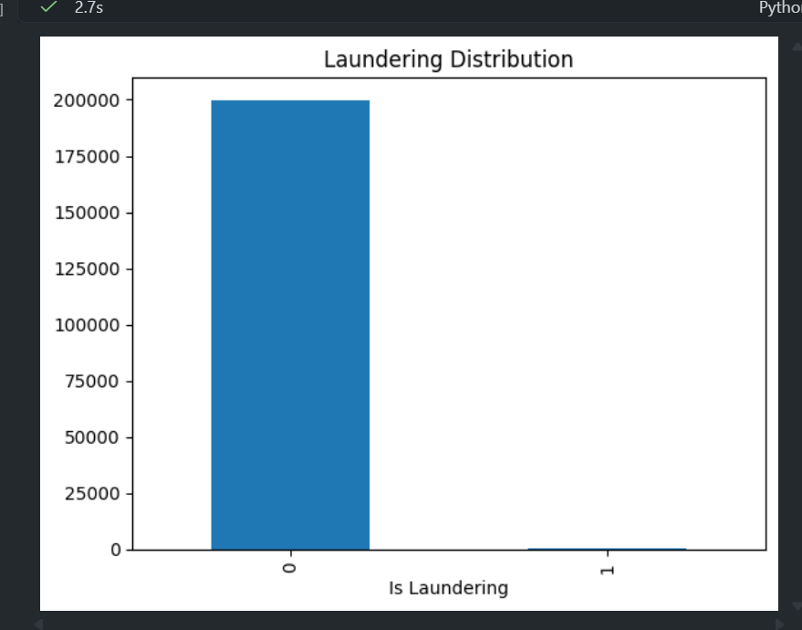

# Open Banking Documentation

This folder contains screenshots and visual evidence for the Open Banking
Personal Finance Intelligence Platform.

## Dashboard Preview

## Visual Gallery

| View | Image |
| --- | --- |
| Dashboard page |  |
| Dashboard detail |  |
| Analysis output |  |
| Workflow visual |  |
| Additional chart |  |
| Additional chart |  |
| Additional chart |  |
| Additional chart |  |
| Additional chart |  |
| Additional chart |  |

## Notes

- Keep dashboard screenshots in this folder so the project README can render
  correctly on GitHub.
- Use descriptive filenames for new screenshots when possible.
