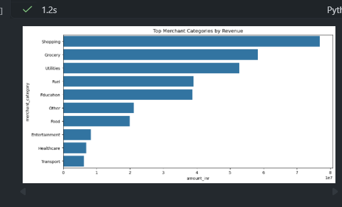

# UPI Ecosystem Documentation

This folder contains screenshots and visual evidence for the UPI Ecosystem
Intelligence project.

## Dashboard Preview

## Dashboard Screenshots

| View | Image |
| --- | --- |
| Executive overview |  |
| Transaction intelligence |  |
| Merchant intelligence |  |
| User intelligence |  |
| Risk intelligence |  |
| Final dashboard view |  |

## Analysis Gallery

| View | Image |
| --- | --- |
| Chart 1 |  |
| Chart 2 |  |
| Chart 3 |  |
| Chart 4 |  |
| Chart 5 |  |
| Chart 6 |  |
| Chart 7 |  |
| Chart 8 |  |
| Chart 9 |  |
| Chart 10 |  |
| Chart 11 |  |
| Chart 12 |  |
| Chart 13 |  |
| Chart 14 |  |
| Chart 15 |  |
| Chart 16 |  |
| Chart 17 |  |
| Chart 18 |  |

## Notes

- Keep screenshots in this folder so the project README renders correctly on
  GitHub.
- Add new dashboard exports here when Power BI pages change.
