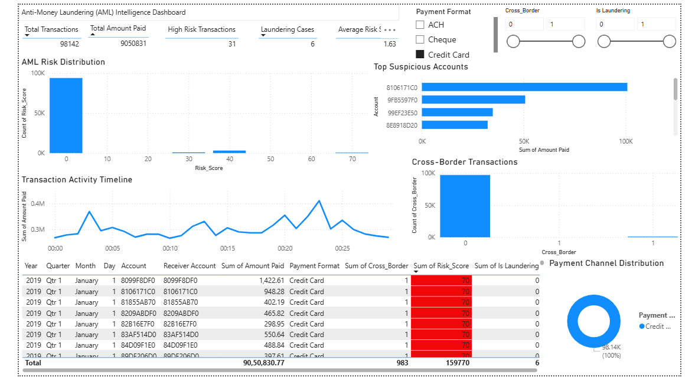
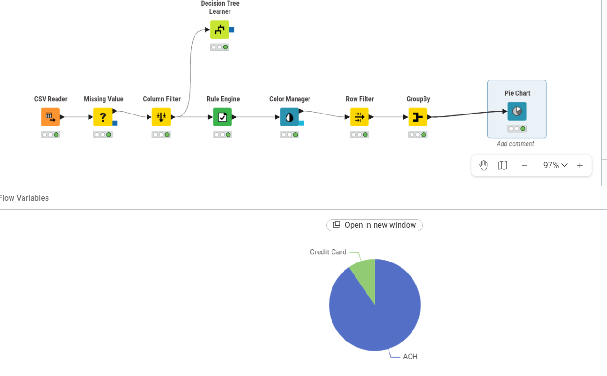

# Anti-Money Laundering Transaction Monitoring Project

This project explores anti-money laundering (AML) monitoring on synthetic
transaction data. It combines Python-based feature engineering and anomaly
detection with Power BI reporting and a KNIME workflow.

The current analysis is based on the first **100,000 transactions** from the
source transaction file. It is an exploratory prototype for identifying
transactions that deserve investigation, not a production AML decision system.

## Project Objectives

- Explore transaction behavior and potential AML risk indicators.
- Engineer interpretable flags for cross-border, large, round-amount, and
  frequent-sender activity.
- Assign a rule-based risk score for triage.
- Detect unusual transactions with Isolation Forest.
- Prepare dashboard-ready data for Power BI.
- Demonstrate an alternate visual workflow in KNIME.

## Key Results

| Metric | Result |
| --- | ---: |
| Transactions analyzed | 100,000 |
| Analysis period in sample | 2019-01-01 00:00 to 2019-01-01 19:13 |
| Total amount paid | 26,308,200.17 |
| Unique sender accounts | 98,970 |
| Cross-border transactions | 1,015 (1.015%) |
| Large transactions | 5,000 (5.000%) |
| Transactions with risk score >= 70 | 58 (0.058%) |
| Isolation Forest anomalies | 1,942 (1.942%) |
| Labeled laundering transactions | 7 (0.007%) |

An important validation result is that the seven labeled laundering
transactions are not flagged by the current high-risk cutoff
(`Risk_Score >= 70`) or by the Isolation Forest model. The rules and model
therefore need improvement before they can support AML investigation reliably.

For the full analysis and interpretation, see
[reports/AML_PROJECT_REPORT.md](reports/AML_PROJECT_REPORT.md).

## Dashboard Preview



The Power BI screenshot above shows the dashboard with the `Credit Card`
payment-format filter selected. In that filtered view, it displays 98,142
transactions, total amount paid of 9,050,831, 31 high-risk transactions, and
6 laundering cases. The full-sample Python metrics remain the results shown
in the Key Results table.

## Risk Scoring Logic

The Python feature-engineering step assigns the following score:

| Indicator | Rule | Score |
| --- | --- | ---: |
| Cross-border transfer | Receiving currency differs from payment currency | +30 |
| Large transaction | Amount paid is above the 95th percentile | +40 |
| Round amount | Amount paid is divisible by 1,000 | +10 |
| Frequent sender | Sender has more than 20 transactions in the sample | +20 |

For this sample, the 95th percentile amount threshold is approximately
`288.52`. The maximum resulting risk score is `90`.

## Project Structure

```text
aml/
|-- README.md
|-- raw-data/
|   `-- trans_3000p2_list.txt
|-- cleaned-data/
|   |-- aml_features.csv
|   `-- powerbi_aml_dataset.csv
|-- python-analysis/
|   |-- 01_load_and_explore.py
|   |-- 02_feature_engineering.py
|   |-- 03_visualizations.py
|   |-- 04_risk_distribution.py
|   |-- 05_transaction_network.py
|   |-- 06_anomaly_detection.py
|   `-- 07_export_dashboard_data.py
|-- reports/
|   |-- AML_PROJECT_REPORT.md
|   |-- top_risk_accounts.csv
|   |-- dashboard.png
|   |-- workflow.png
|   |-- image.png
|   |-- image copy.png
|   |-- Figure_1.png
|   |-- Figure_2.png
|   |-- Figure_3.png
|   `-- Figure_4.png
|-- powerbi-dashboard/
|   `-- anti money laundering.pbix
|-- knime-workflow/
|   `-- AML_Fraud_Detection_Workflow/
`-- AML-Data-Public/
    `-- Dataset_A-45M_Transactions (Feb 2021)/
```

## Technologies

- Python: `pandas`, `numpy`, `matplotlib`, `networkx`, `scikit-learn`
- Power BI Desktop for interactive reporting
- KNIME Analytics Platform for visual workflow analysis
- IBM synthetic AML transaction dataset included in `AML-Data-Public/`

## Dataset Reference

The source data is the IBM synthetic Anti-Money Laundering dataset prepared by
Erik Altman. The included dataset documentation describes synthetic
transactions among virtual-world entities and a laundering label for model
development and evaluation.

- Dataset documentation: `AML-Data-Public/README.boxnote`
- IBM data documentation link:
  <https://ibm.ent.box.com/v/AML-Anti-Money-Laundering-Data/file/780515045707>
- Updated dataset publication:
  <https://www.kaggle.com/datasets/ealtman2019/ibm-transactions-for-anti-money-laundering-aml>

The 4.53 GB extracted raw transaction file and its large archive are excluded
from GitHub because they exceed normal repository file-size limits. The
processed 100,000-row analysis outputs in `cleaned-data/` remain included.

## Run The Python Analysis

Install the Python packages:

```powershell
pip install pandas numpy matplotlib networkx scikit-learn
```

Run the scripts from the `python-analysis` directory so the relative data
paths resolve correctly:

```powershell
cd aml\python-analysis
python 01_load_and_explore.py
python 02_feature_engineering.py
python 03_visualizations.py
python 04_risk_distribution.py
python 05_transaction_network.py
python 06_anomaly_detection.py
python 07_export_dashboard_data.py
```

The visualization scripts display charts interactively. Existing report
images are stored in `reports/`. The export script creates:

- `cleaned-data/powerbi_aml_dataset.csv`
- `reports/top_risk_accounts.csv`

## Dashboard And Workflow Files

- Open `powerbi-dashboard/anti money laundering.pbix` in Power BI Desktop to
  explore the dashboard based on the exported CSV.
- Open `knime-workflow/AML_Fraud_Detection_Workflow` in KNIME to view the
  executed visual workflow, which includes reading, cleaning, rule
  processing, aggregation, and a decision tree component.





## Limitations And Next Steps

- Only a 100,000-row slice of the source file is analyzed.
- The rule score does not currently capture the labeled laundering examples.
- The network visualization is dominated by high-risk self-transfers in this
  sample and requires further behavioral investigation.
- Model evaluation should add recall, precision, confusion matrices, and
  threshold testing against the laundering label.
- Further features should examine transaction chains, rapid movement of funds,
  counterparties, account history, and currency-conversion patterns.
